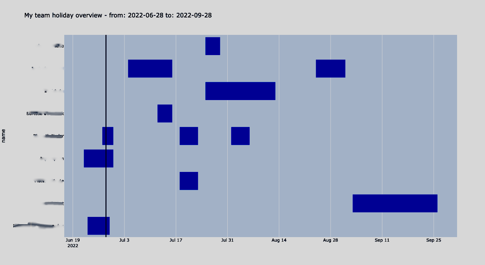

# My team holiday overview
This script retrieves the time off requests from Bamboo HR API and show them on a timeline chart.
This helps to spot overlapping time off within a team

NOTE: team = the user and its direct reports

THE SOFTWARE IS PROVIDED "AS IS", WITHOUT WARRANTY OF ANY KIND, SEE [LICENSE FILE](./LICENSE) FOR FURTHER DETAILS



---
## Usage:
### Requirements:
- python 3.x
- Bamboo HR API Key (you can generate one in your profile section on Bamboo)

### Install & run:
1. clone this repo in a folder
2. create & activate a python virtualenv (optional but recommended)

    ```$ python -m venv .venv```

    ```$ source .venv/bin/activate``` 

3. Install dependencies

    ```$ pip install -r requirements.txt```

4. retrieve your API Key from Bamboo and store into an environment variable

    ```$ export BAMBOOHR_KEY=<YOUR API KEY GOES HERE>```

5. run the script!

    ```$ python holiday_overview.py```

    this will open your browser showing the timeline chart

### More info:
```$ python holiday_overview.py -h```

to get some easter eggs